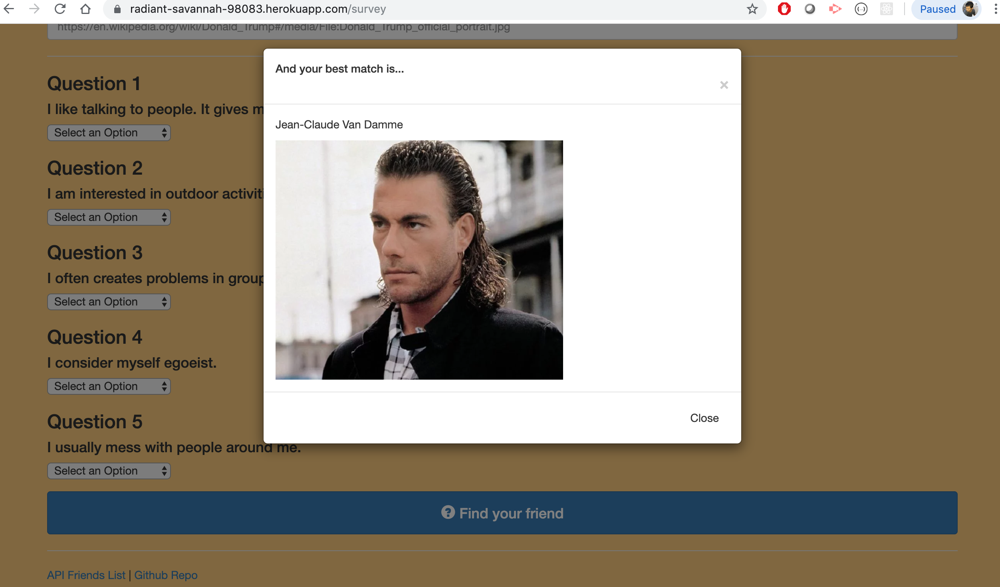

# Friend-Finder
# Express.js homework

# Friend Finder

## SEE THE DEMO 

## View Sharable link below!!
https://drive.google.com/open?id=1zHd3PDzU3L0fmrXyWgsqkyH8Et4zL8lo

## Description

Friend Finder is a compatibility based dating app. This is a full-stack site where users completes a survery, then their answers are compared with those from other users. The app then displays the best match of user's input to those of overall match with name and picture of a best friend. Please check the DEMO video link provided above to best familiarize yourself with this app.

## How This App work?
This App was made working with the help of following dependencies:
* body-parser
* express
* path

## What will user Do?

* The user will first visit the home page. The home page will tell them to take the survey.
* The user will be directed to survey page whem they click on the survey button.
* The survey page will tell the user to input his/her name and provide a link to his/her      picture.
* The user will then complete the survey questions that follows based on their degree of stisfaction.
* The App will then display the best match of user with the name and picture of their best friend.
